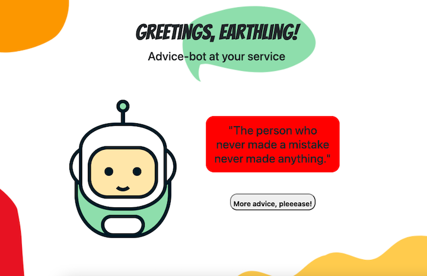

# Advice-Bot

This single page application uses the Advice Slip API to fetch random pieces of advice and display them to the user. The user will find that at times Advice-Bot may offer a few words of wisdom, and other times it will simply provide a quick laugh.

## Table of Contents
* [Description](#advice-bot)
* [Demo & Site Link](#demo--site-link)
* [Technologies Used]()
* [Author](#author)
* [License](#license)

## Demo & Site Link

* [Advice Bot - Live Site](https://lesliejpatino.github.io/advice-bot/)
 
Advice-Bot was made entirely through CSS 
 

 

## Technologies Used
* [Advice Slip Api](https://api.adviceslip.com/#top)
* [Bootstrap](https://getbootstrap.com/)
* [Javascript](https://www.javascript.com/)
* [CSS Robot](https://dev.to/akhilarjun/css-art-let-s-create-a-cute-robot-part-1-3ng5)
* [CSS](https://www.w3.org/Style/CSS/Overview.en.html)
* [HTML](https://html.com/)

## Author
**[Leslie Patino](https://lesliejpatino.github.io/portfolio/)**

* [Leslie's LinkedIn](https://www.linkedin.com/in/lesliejpatino/)
* [Leslie's GitHub](https://github.com/lesliejpatino)

## License
Copyright (c) 2022 Leslie Patino  
  
